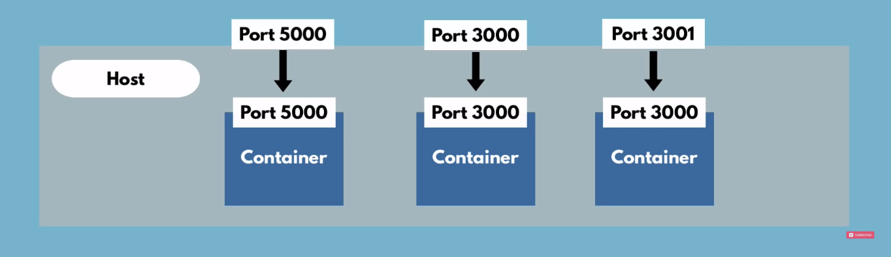

## Docker Image
* A docker image itself is a layer of images 
    * Starting from the base layer (OS) to the application layer
    * Usually the base layer is _alpine_ flavour of Linux because it is small in size, thus not making your custom docker image not too large

* When you pull an image from the docker repository, it first checks locally if the image is available. If not it fetches from the dockerHub repository
* And next time when you are pulling a newer version, it only fetches **only** the image layers that are changed. It does not fetch the entire image

* You can run multiple versions of the same service with docker (without any conflict)

## Docker vs VM

## Why Docker
* When you build an application, it will have many dependencies. We package all these dependencies along with the application and create something called a docker image. This docker image can be pulled from other machines from a docker repository and containers can be started
* So, if you had to do it manually, you would have to go ahead and install every dependency and configure it for your application you plan to run on every machine. But now you just have to pull your docker image from a repository and launch your containers. BOOM! JOB DONE!

   

## Port Conflict
* MySQL uses port 3306
* If your run multiple versions of the same service in your machine, then both the versions will use the same port to communicate with the user (which is not possible)
* So, when you start the container using the `run` command you specify different ports to listen on
```
docker run -p3000:3306 mysql
```
And similarly, for the other version
```
docker run -p3001:3306 mysql:5"
```
* So, now the requests are received in ports 3000 and 3001 in your host machine and forwards those requests to port 3306 of different containers running MySQL


> Conflicts arise when we try to use the same port on the host machine for different services

## Docker Compose
* Instead of specifying all the configurations for your container in the command line itself, you can have it in a yaml file in a structured way 
* Example:
    ```yaml
    # mongo.yaml
    version: 3 
    services:
    service1: # Any name 
        image: mongo
        ports:
         - 25721:25721
        environment:
         - ROOT_USERNAME=admin
         - ROOT_PASSWORD=password
    service2:
        image: mongo-express
        ports:
         - 8080:8081
        environment: 
         - ROOT_USERNAME_MONGOEXP=admin
         - ROOT_PASSWORD_MONGOEXP=password
    ```
* Then, we use the `docker-compose` commands to start and stop the containers
```
docker-compose -f mongo.yaml up -d
```
* This launches all the containers mentioned in the yaml file.
    * And a network is created by default, that is common for the services(containers) in the same yaml file
```
docker-compose -f mongo.yaml down
```
## Dockerfile
* **Dockerfile** is used to build images. _Dockerfile_ contains the steps to build the image
* Here's a sample _Dockerfile_
```dockerfile
FROM node:latest

ENV MONGO_DB_USERNAME=admin \
    MONGO_DB_PASSWORD=passwd 

RUN mkdir -p /home/app

COPY ./app /home/app

CMD ["node", "server.js"]
```
* `FROM` is used to specify the base image from which the current image is going to be created 
* `ENV` is used to set the environmental variables
* `RUN` is used to run commands inside the container
* `COPY` is used to copy the contents from the host machine to the container
* `CMD` is used to run one single command which is the entrypoint for starting the application inside the container 

## Docker Volumes
* Data is lost by default when a container is stopped. If you want your data to be persistent, you need to make use of _docker volumes_
* Docker volumes actually mean connecting your physical file system (Host file system) to your Virtual file system (container file system) 


* We use `-v` flag to specify the volumes in the `docker run` command
* There are 3 types of volumes:
    * Host Volumes
        
    * Anonymous volumes
        
    * Named Volumes
        
    
### volumes in docker-compose.yaml

* You can also mount the same volume to multiple containers. This allows the containers to share the data between them
> Add a driver aswell in volumes section
```yaml
volumes:
    db-data: # volume name
        driver: local
```
* In specifying the path for your application to the container, search (on the web) where your application stores your app's data first and then specify that path. It's not just any path 
## Docker commands
> You can also use the _container name_ instead of _container id_
```
docker images
```
* Lists all the docker images in the local machine
___
```
docker pull <image>
```
* Pulls a docker image from repository
___
```
docker run <image>
```
* Starts a container from the given image. If image does not exist, it is pulled from the repository
* `-d` flag can bsed for starting container in detached mode
* `-p` flag for to map ports in host machine to container ports
* `--name` flag can be used to mention the name of the container
* `--net` flag to specify the network you want to launch your container
___
```
docker ps
```
* List of containers running
* Using the `-a` flag, lists all the stopped containers aswell 
___
```
docker stop <container_id>
```
* Stops the container
___
```
docker start <container_id>
```
* Starts stopped container
___
```
docker logs <container_id>
```
* Displays the logs for the container
___
```
docker exec -it <container_id> /bin/bash
```
* Open an _interactive_ terminal in a container; `-it` stands for interactive
> if `bash` is not available, try using `sh`
___
```
docker network ls
```
* Lists all the docker networks
___
```
docker network create <nw_name>
```
* Creates a docker network
> You use `--net` flag when using the `run` command to specify the network you want to launch your container
___
```
docker rm <container_id>
```
* Removes a stopped container 
___
```
docker rmi <image_id>
```
* Deletes an image 
___
```
docker build -t <name:tag> <path_to_Dockerfile>
```
* Builds docker image from Dockerfile
___
```
docker tag <image:tag> <new_image_name:tag>
```
* Renames the Dockerfile (It actually creates a copy of the image with the new name)
___